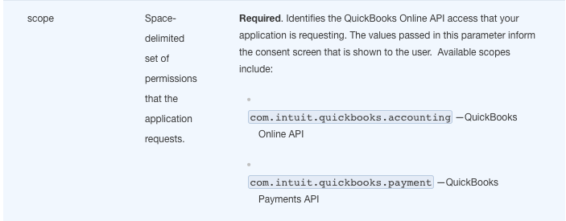
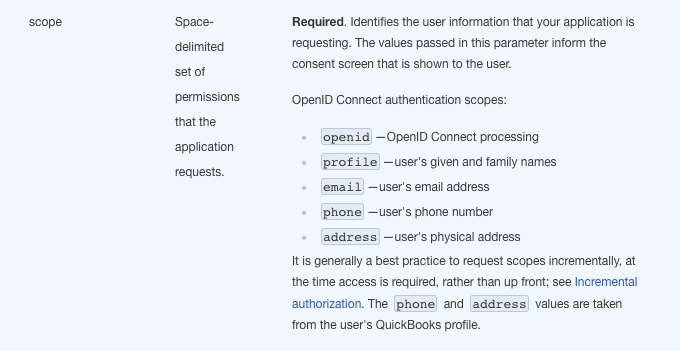
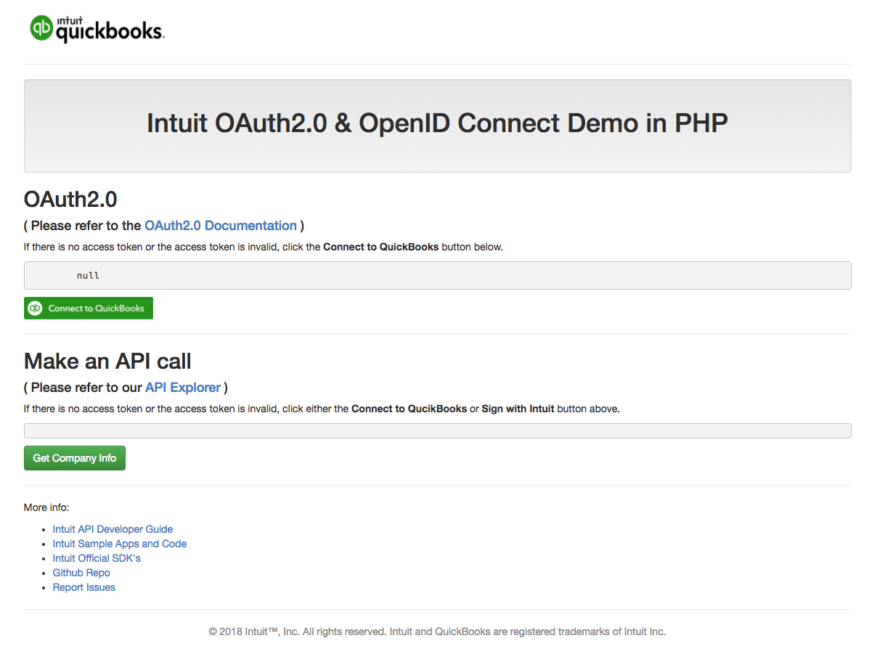

[][ss1]

Intuit OAuth2.0 and OpenID Connect Demo in PHP
==========================================================

## Overview

This is a sample `Demo` app in PHP to showcase how to Authorize using `OAuth2.0` and `OpenID Connect` and to make API calls using the [QuickBooks-V3-PHP-SDK](https://github.com/intuit/QuickBooks-V3-PHP-SDK) SDK

This sample app is meant to showcase an example of how to integrate your app with the Intuit Developer Platform. It showcases the following:

* Authorize into the app via [OAuth2.0](https://developer.intuit.com/docs/00_quickbooks_online/2_build/10_authentication_and_authorization/10_oauth_2.0) OR
* Authorize into the app via [OpenIDConnect](https://developer.intuit.com/docs/00_quickbooks_online/2_build/10_authentication_and_authorization/50_identity/20_openid_connect)
* API call using the above ( access token / refresh token ) to `GetCompanyInfo` 


## Installation

### Via Github Repo (Recommended)

```bash
$ git clone https://github.com/IntuitDeveloper/HelloWorld-PHP.git
$ cd HelloWorld-PHP
$ curl -sS https://getcomposer.org/installer | php
$ composer install
```

## Pre-requisites

* **Create an Intuit Developer account and app**:  
You must have an Intuit Developer account and have created an app. To know more refer to the [Get Started guide](https://developer.intuit.com/app/developer/qbo/docs/get-started) 
* **Get client keys**:    
  Obtain OAuth 2.0 client keys from your app's dashboard on developer.intuit.com.  To locate the app's dashboard, sign in to developer.intuit.com and click My Apps. Find and open the app you want. From here, click the Keys tab. There are two versions of this key:
  * Development keys—use only in the sandbox environment.
  * Production keys—use only in the production environment. 
* **Define redirect URI**:  
 On the app setting page, create one or more redirect URIs. These URIs handle responses from the OAuth 2.0 server and are called after the user authorizes the connection.


## Configuration

Edit the `config.php` file to add your:  

* **clientId:** You can find your `clientId` from the `Keys` tab under your `App` listed on the developer portal
* **clientSecret:** You can find your `clientSecret` from the `Keys` tab under your `App` 
* **redirectUri:** The `redirectUri` for your app ( **OAuth2.0** )

In the [Developer Portal](http://developer.intuit.com/), ensure the redirect URI in your `config.json` file has been entered in your app configuration. By default, the URL is set to the following for this demo:

`http://localhost:3000/callback.php`


### TLS / SSL (**optional**)

If you want your enpoint to be exposed over the internet. The easiest way to do that while you are still developing your code locally is to use [ngrok](https://ngrok.com/).  

Here are the steps to configure ngrok  
1. Download and install ngrok  
2. Expose your localhost by running "ngrok http 3000" on the command line.  
3. You will then get a forwarding url that looks something like this: Forwarding https://755c8b38.ngrok.io -> localhost:3000

This will expose localhost:3000 to the Internet. Your endpoint url will now be https://755c8b38.ngrok.io/callback.php Copy this url and use it for setting the redirectUri  [Intuit Developer Portal](https://developer.intuit.com) for your app.


## Difference between OAuth2.0 and OpenID Connect

Lets take a look at the key differences between OAuth2.0 and OpenID connect as per the authorization flow is :

 

* **OAuth2.0**  
 
    * Scope - Available scopes include: (Space delimited set of permissions that the application requests)
                 
          com.intuit.quickbooks.accounting — QuickBooks Online API
                 
          com.intuit.quickbooks.payment — QuickBooks Payments API   
           
          com.intuit.quickbooks.payroll—QuickBooks Payroll API (whitelisted beta apps only)
          
          com.intuit.quickbooks.payroll.timetracking—QuickBooks Payroll API for for access to compensation (whitelisted beta apps only)
          
          com.intuit.quickbooks.payroll.benefits—QuickBooks Payroll API for access to benefits/pension/deduction (whitelisted beta apps only)
    
         
             
    * OAuth2.0 authorization flow  
      
    
    * OAuth2.0 Documentation - click [here](https://developer.intuit.com/docs/00_quickbooks_online/2_build/10_authentication_and_authorization/10_oauth_2.0)
    
    
* **OpenID Connect**

    * Scope -  Available scopes include: (Space delimited set of permissions that the application requests)   
                     
          openid — QuickBooks Online API
                 
          profile — QuickBooks Payments API  
             
          email - user's email address  
                     
          phone - user's phone number  
            
          address - user's physical address                   
        
         
                       
    * OAuth2.0 authorization flow  
      
 
    * OpenID Connect Documentation - click [here](https://developer.intuit.com/docs/00_quickbooks_online/2_build/10_authentication_and_authorization/50_identity/20_openid_connect) 
    

## Usage

```bash
$ php -S localhost:3000
```

### Start ngrok (if you are using ngrok )

```bash
$ ngrok http 3000
```

Go to the URL (you must start ngrok if using it):

```
https://755c8b38.ngrok.io/
````

Then click the <input type="button" value="Login (OAuth2.0)"> button to authorize the demo app and view the access token.

Events are logged to the Node.js console.



[ss1]: https://help.developer.intuit.com/s/samplefeedback?cid=9010&repoName=HelloWorld-PHP
